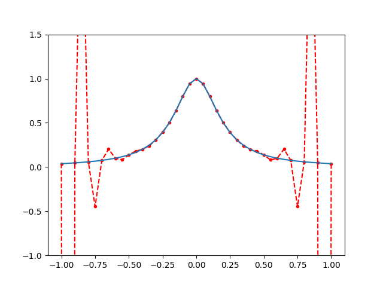
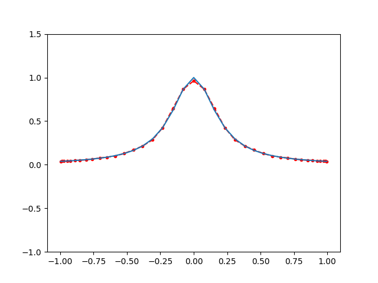
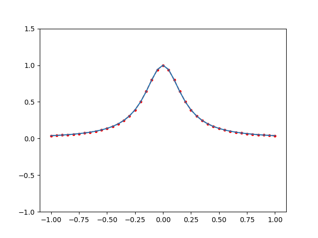
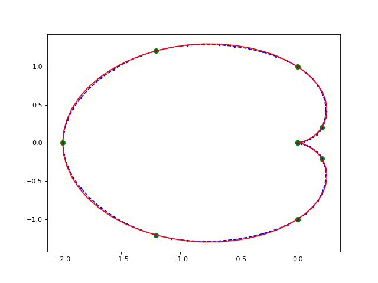

 
 计算物理第二次作业  
 刘茁   
 1500011438 

# 1. Runge效应
注：本题运行结果出自于 interpolation.py。程序运行结果如图所示，具体数值表请见附件。
## (a)
- 这里我采用的是neville方法。

- 作图如下所示。蓝色线条是标准值，红色是neville差值得到的结果。运行结果出自于neville.txt。 

 

 neville 

 

## (b)
- 作图如下所示。蓝色线条是标准值，红色是cbevbyshev近似得到的结果。运行结果出自于chebyshev.txt。
  

 chebyshev 

 

## (c)
- 作图如下所示。蓝色线条是标准值，红色是样条函数差值得到的结果。运行结果出自于spline.txt。 
  
 

 spline 
 

# 2. 样条函数在计算机绘图中的应用
注：本题运行结果出自于 cardiod.py
## (a)
- 运行结果列表如下

 
|t| $x_t$| $y_t$|
|:-:|:-:|:-:|
|0|0.0000|0.0000| 
|1|0.2071|0.2071| 
|2|0.0000|1.0000| 
|3|-1.2071|1.2071| 
|4|-2.0000|0.0000| 
|5|-1.2071|-1.2071| 
|6|-0.0000|-1.0000| 
|7|0.2071|-0.2071| 
|8|0.0000|-0.0000| 

## (b)
- 这里的样条函数是由第一题中编写的函数得到的。
- 需要注意的是，第一问中采用的是第三类边界条件。在本题的要求下，由于心形线的特点，应当采用第二类边界条件。为简单起见，我设置三次样条函数的左右一阶导数为0，这保证了闭合处的连续性。
  
- 按照下式的表示给出三次样条函数的系数
$$S _ { \Delta } ( X ; x ) = A_{Xj} \frac { \left( x _ { j + 1 } - x \right) ^ { 3 } } { 6 h _ { j + 1 } } + B_{Xj} \frac { \left( x - x _ { j } \right) ^ { 3 } } { 6 h _ { j + 1 } } + C _ { Xj } \left( x - x _ { j } \right) + D _ { Xj }$$
$$S _ { \Delta } ( Y ; x ) = A_{Yj} \frac { \left( x _ { j + 1 } - x \right) ^ { 3 } } { 6 h _ { j + 1 } } + B_{Yj} \frac { \left( x - x _ { j } \right) ^ { 3 } } { 6 h _ { j + 1 } } + C _ { Yj } \left( x - x _ { j } \right) + D _ { Yj }$$

 

|j| $A_{Xj}$| $B_{Xj}$ |$C_{ Xj }$|$D _ { Xj }$|
|:-:|:-:|:-:|:-:|:-:|
|0|-0.1418|0.0765|0.4254|-0.1418| 
|1|0.0765|0.2500|-0.0336|0.2836| 
|2|0.2500|-0.0765|-1.5336|0.2500| 
|3|-0.0765|-0.3582|-1.0746|-1.2836| 
|4|-0.3582|-0.0765|1.0746|-2.3582| 
|5|-0.0765|0.2500|1.5336|-1.2836| 
|6|0.2500|0.0765|0.0336|0.2500| 
|7|0.0765|-0.1418|-0.4254|0.2836| 
 

|j| $A_{Yj}$| $B_{Yj}$ |$C_{ Yj }$|$D _ { Yj }$|
|:-:|:-:|:-:|:-:|:-:|
|0|-0.0194|-0.1683|0.0582|-0.0194| 
|1|-0.1683|0.1068|1.0680|0.0388| 
|2|0.1068|0.3269|0.4271|1.1068| 
|3|0.3269|0.0000|-1.5340|1.5340| 
|4|0.0000|-0.3269|-1.5340|0.0000| 
|5|-0.3269|-0.1068|0.4271|-1.5340| 
|6|-0.1068|0.1683|1.0680|-1.1068| 
|7|0.1683|0.0194|0.0582|-0.0388| 

## (c)
- 作图如下所示。红色线条是标准值，蓝色虚线是由三次样条函数画出来的结果，绿色点是第一问中的标准点。
  

 cardioid 

 

## (d)
- 三次样条插值的方法要求导数和二阶导数的连续性，因此保证了连接点时的平滑。

# 3. 含有zeta函数的方程求解
## (a)
- 在$l=m=0$的情形下，将$Z$写成四项
$$
Z_{00} (1;q^2)= \frac{e^{q^2}}{\sqrt{4\pi}} \sum_{\mathbf{n}} \frac{e^{-\mathbf{n}^2}}{\mathbf{n}^2-q^2} +\frac{\sqrt{\pi}}{2}\int_{0}^{1} dt\cdot t^{-3/2}e^{tq^2}\sum_{\mathbf{n} \ne 0}e^{-(\pi^2/t)\mathbf{n}^2}+ \frac{\pi}{2}\int_0^{1} dt\cdot t^{-3/2}(e^{tq^2}-1)-\pi 
$$

- 首先关注第一项，令$D(x)$为满足$|\mathbf{n}^2|=x$的$\mathbf{n}$的个数。为了确定误差范围，我们关注$|\mathbf{n}|\ge n_0$的项的上界，之后我们统一将这些余项和记为R

$$R=\sum_{|\mathbf{n}^2|\ge n_0^2} \frac{e^{-\mathbf{n}^2}}{\mathbf{n}^2-q^2}=\sum_{x\ge n_0^2} \frac{e^{-x}}{x-q^2}\cdot D(x)$$

被求和式随$|\mathbf{n}|$的增大显然单调递减，因此
$$ R\le \sum_{r\ge n_0}\frac{e^{-r^2}}{r^2-q^2}\left(\sum_{r^2\le x<(r+1)^2}D(x)\right)$$
$\sum_{r^2\le x<(r+1)^2}D(x)$为半径$r$到$r+1$球壳中的格点数，在$r$较大时可近似为$4\pi r^2$,将上界改写为积分形式
$$\begin{aligned}
R &\le \sum_{r\ge n_0}\frac{e^{-r^2}}{r^2-q^2}\left(\sum_{r^2\le x<(r+1)^2}D(x)\right)\\
& \approx \int_{n_0}^\infty 4\pi r^2 \frac{e^{-r^2}}{r^2-q^2} dr\\
& = \int_{n_0}^\infty \left(1+\frac {q^2}{r^2-q^2}\right) 4\pi e^{-r^2} dr\\
& \le \left(1+\frac {3}{n_0^2-3}\right)\cdot 2\pi^{3/2}(1-erf(n_0))
\end{aligned} $$

取$n_0=4$时
$$R\le 2.1\times 10^{-7}$$
足以达到6位有效数字的精度；若要达到12位有效数字，则$n_0$需取6

- 再来关注第二项。交换求和号和积分号的顺序（收敛性允许我们这么做），我们得到第三项的R可以表示为
$$R\le\frac{\sqrt{\pi}}{2}e^{q^2}\sum_{|\mathbf{n}|\ge n_0}\int_{0}^{1} dt\cdot t^{-3/2}e^{-(\pi^2/t)\mathbf{n}^2}$$
令$x=\frac 1 {\sqrt{t}}$，有
$$R\le\sqrt{\pi}e^{q^2}\sum_{|\mathbf{n}|\ge n_0}\int_{1}^{\infty}e^{-\pi^2\mathbf{n}^2x^2}dx=\frac{e^{q^2}}{\pi^{(3/2)}}\sum_{|\mathbf{n}|\ge n_0}\frac{e^{-\pi^2\mathbf{n}^2}}{\mathbf{n}^2}$$
  与第一项同样的做法，将求和转化为积分，并令$r=|\mathbf{n}|\pi$
$$\begin{aligned}
R & \approx \sqrt{\pi}e^{q^2}\int_{n_0}^\infty 4\pi r^2 \frac{e^{-r^2}}{r^2} dr\\
& = 4 \pi^{3/2}e^{q^2} \int_{n_0}^\infty  e^{-r^2} dr\\
& \le 2\pi e^{q^2}\mathrm{erfc}(\pi n_0)
\end{aligned} $$
注意$q^2<3$，当$n_0$取$2$时，
$$R\le8.0\times10^{-17}$$
在相同的$n_0$下，这一项的大小远远小于第一项，因此可以忽略。

- 最后来看第三项。第三项是一个瑕积分，真正计算的时候可以利用泰勒展开来处理。
$$e^{tq^2}=\sum_{m=0}\frac {(tq^2)^m}{m!}$$
代入原式中，交换求和和积分的顺序(积分收敛时允许我们这么做)
$$\frac{\pi}{2}\int_{0}^{1} dt\cdot t^{-3/2}(e^{tq^2}-1)=\frac {\pi}{2}\sum_{m=1}^{\infty}\frac{q^{2m}}{m!(m-\frac 1 2)}$$
这就化为和上面一样的截断问题。假设当$m=m_0-1$时截断，则与上面一样，R可以表示为
$$
\begin{aligned}
R & =\frac{\pi}{2}\sum_{m=m_0}^{\infty}\frac{q^{2m}}{m!(m-\frac 1 2)}\\
& <\frac{\pi}{2}\sum_{m=m_0}^{\infty}\frac{q^{2m}}{m!} \\
& <e^{q^2}\cdot\frac {(q^2)^{m_0+1}}{(m_0+1)!} \\
& <e^3\cdot\frac {3^{(m_0+1)}}{(m_0+1)!} \end{aligned}
$$
计算发现当$m_0=18$时余项不超过$1\times 10^{-7}$，当$m_0=25$时余项不超过$1\times 10^{-12}$，则该级数只需求和到$m=17$和$m=24$即可达到6位和12位有效数字的要求。

- 需要注意的是，我们的讨论是基于函数准确值是在10的0次方量级的。这一假设在绝大多数情况是成立的。但是，也存在一些特殊的情况。比如第一项的求和在$q^2 \to 0,1,2,3$的情况下是趋于无穷大的，这种情况对有效数字的估计将会带来不可确定的影响，我们的讨论不包含这种情况。
- 最后，为了保证有效数字和我们之前讨论时关注的精确到小数点后几位的一致性，我们需要简单考察和式的大小。这个问题其实可以通过下一问数值计算来证明。通过保留足够多的项，我们容易发现大多数时候$Z_{00}$都是大于1的，我们的讨论除开一些奇异点都是有效的。

## (b)
$$f(q^2) = Z_{00}(1;q^2) - \pi^{3/2}\left(\frac{1}{A_0} + \frac{1}{2}R_0 q^2\right)$$
- 我们的问题是求f在[0,1]上的零点。$Z_{00}$的计算是这个问题的重点。
$$
\mathcal{Z}_{00}(1;q^2)= \frac {e^{q^2}} {\sqrt{4\pi}}\sum_{\mathbf{n}} \frac{e^{-\mathbf{n}^2}}{\mathbf{n}^2-q^2}
+\frac{\pi}{2}\int_{0}^{1} dt\cdot t^{-3/2}(e^{tq^2}-1)
+\frac{\sqrt{\pi}}{2}\int_{0}^{1} dt\cdot t^{-3/2}e^{tq^2}\sum_{\mathbf{n}\ne0}e^{-(\pi^2/t)\mathbf{n}^2}-\pi
$$
- 式中第一项为简单求和，依据第一问结果，计算到$|\mathbf{n}|=4$即可。
- 第二项，同样我们用上一问求出的求和式直接求和即可。
- 第三项的计算。第三项只需求和到$|\mathbf{n}|<2$，且被积函数并不发散，那么我们将其形式写成
$$\frac{\sqrt{\pi}}{2}\int_{0}^{1} dt\cdot t^{-3/2}e^{tq^2}\left(6e^{-\pi^2/t}+12e^{-2\pi^2/t}+8e^{-3\pi^2/t}\right)$$
从理论上来说，可以直接运用Simpson法则进行分段积分，但我们需要分别计算$t^{-3/2}$ 和$e^{-\alpha/t}$，当$t\to0$时均会有很大误差。于是我们考虑将积分下界改为$\epsilon$，考虑到6位有效数字的要求，只要积分在$0\sim \epsilon$上的值小于$10^{-7}$就不会对我们的结果产生影响。于是有
$$\begin{aligned}
\Delta&\le\frac{\sqrt{\pi}}{2}\int_{0}^{\epsilon} dt\cdot t^{-3/2}e^{tq^2}e^{-\pi^2 /t}\times 26\\
&\le 26\sqrt{\pi}\cdot e^{\epsilon q^2}\int_{1/\sqrt{\epsilon}}^{\infty}e^{-\pi^2 x} dx\\
&\le\frac{26e^\epsilon}{\pi^{3/2}} e^{-\pi^2/\sqrt{\epsilon}}
\end{aligned}$$
数值计算知当$\epsilon=0.2$时，$\Delta<1.5\times10^{-9}$，达到我们的要求，因此我们将第三项的积分限改为$[0.2,1]$，并采用Simpson法则，分成1000片进行积分。
- 求解过程详见 zeta_function.py， 最后求得的结果为
  $$q^2 = 0.794516$$

# 附录

## 1. (a) Neville 差值运行结果表
 

|$x$|$f(x)$|$P_{20}(x)$|$\Delta$|
|:-:|:-:|:-:|:-:|
|-1.00|0.0384615|0.0384615|-0.0000000| 
|-0.95|0.0424403|-39.9524490|-39.9948894| 
|-0.90|0.0470588|0.0470588|-0.0000000| 
|-0.85|0.0524590|3.4549578|3.4024988| 
|-0.80|0.0588235|0.0588235|0.0000000| 
|-0.75|0.0663900|-0.4470520|-0.5134420| 
|-0.70|0.0754717|0.0754717|0.0000000| 
|-0.65|0.0864865|0.2024226|0.1159361| 
|-0.60|0.1000000|0.1000000|0.0000000| 
|-0.55|0.1167883|0.0806600|-0.0361283| 
|-0.50|0.1379310|0.1379310|0.0000000| 
|-0.45|0.1649485|0.1797626|0.0148142| 
|-0.40|0.2000000|0.2000000|0.0000000| 
|-0.35|0.2461538|0.2384459|-0.0077079| 
|-0.30|0.3076923|0.3076923|0.0000000| 
|-0.25|0.3902439|0.3950931|0.0048492| 
|-0.20|0.5000000|0.5000000|0.0000000| 
|-0.15|0.6400000|0.6367553|-0.0032447| 
|-0.10|0.8000000|0.8000000|0.0000000| 
|-0.05|0.9411765|0.9424904|0.0013139| 
|0.00|1.0000000|1.0000000|0.0000000| 
|0.05|0.9411765|0.9424904|0.0013139| 
|0.10|0.8000000|0.8000000|0.0000000| 
|0.15|0.6400000|0.6367553|-0.0032447| 
|0.20|0.5000000|0.5000000|0.0000000| 
|0.25|0.3902439|0.3950931|0.0048492| 
|0.30|0.3076923|0.3076923|0.0000000| 
|0.35|0.2461538|0.2384459|-0.0077079| 
|0.40|0.2000000|0.2000000|-0.0000000| 
|0.45|0.1649485|0.1797626|0.0148142| 
|0.50|0.1379310|0.1379310|0.0000000| 
|0.55|0.1167883|0.0806600|-0.0361283| 
|0.60|0.1000000|0.1000000|0.0000000| 
|0.65|0.0864865|0.2024226|0.1159361| 
|0.70|0.0754717|0.0754717|0.0000000| 
|0.75|0.0663900|-0.4470520|-0.5134420| 
|0.80|0.0588235|0.0588235|0.0000000| 
|0.85|0.0524590|3.4549578|3.4024988| 
|0.90|0.0470588|0.0470588|0.0000000| 
|0.95|0.0424403|-39.9524490|-39.9948894| 
|1.00|0.0384615|0.0384615|0.0000000| 
 

 ## 1. (b) Chobyshev 近似运行结果表

 

 
|$x$|$f(x)$|$P_{20}(x)$|$\Delta$|
|:-:|:-:|:-:|:-:|
|0.9969173|0.0386906|0.0386906|0.0000000| 
|0.9846436|0.0396227|0.0410124|0.0013898| 
|0.9723699|0.0405884|0.0405884|-0.0000000| 
|0.9481247|0.0426012|0.0410278|-0.0015735| 
|0.9238795|0.0447651|0.0447651|0.0000000| 
|0.8882598|0.0482506|0.0500512|0.0018006| 
|0.8526402|0.0521516|0.0521516|-0.0000000| 
|0.8065231|0.0579308|0.0557609|-0.0021698| 
|0.7604060|0.0647022|0.0647022|-0.0000000| 
|0.7049270|0.0744987|0.0772938|0.0027951| 
|0.6494480|0.0866208|0.0866208|0.0000000| 
|0.5859733|0.1043393|0.1004211|-0.0039182| 
|0.5224986|0.1277936|0.1277936|-0.0000000| 
|0.4525910|0.1633729|0.1695111|0.0061382| 
|0.3826834|0.2145386|0.2145386|-0.0000000| 
|0.3080644|0.2965079|0.2853643|-0.0111436| 
|0.2334454|0.4232950|0.4232950|0.0000000| 
|0.1559522|0.6218799|0.6452555|0.0233756| 
|0.0784591|0.8666294|0.8666294|0.0000000| 
|0.0000000|1.0000000|0.9624097|-0.0375903| 
|-0.0784591|0.8666294|0.8666294|-0.0000000| 
|-0.1559522|0.6218799|0.6452555|0.0233756| 
|-0.2334454|0.4232950|0.4232950|0.0000000| 
|-0.3080644|0.2965079|0.2853643|-0.0111436| 
|-0.3826834|0.2145386|0.2145386|-0.0000000| 
|-0.4525910|0.1633729|0.1695111|0.0061382| 
|-0.5224986|0.1277936|0.1277936|-0.0000000| 
|-0.5859733|0.1043393|0.1004211|-0.0039182| 
|-0.6494480|0.0866208|0.0866208|-0.0000000| 
|-0.7049270|0.0744987|0.0772938|0.0027951| 
|-0.7604060|0.0647022|0.0647022|0.0000000| 
|-0.8065231|0.0579308|0.0557609|-0.0021698| 
|-0.8526402|0.0521516|0.0521516|-0.0000000| 
|-0.8882598|0.0482506|0.0500512|0.0018006| 
|-0.9238795|0.0447651|0.0447651|-0.0000000| 
|-0.9481247|0.0426012|0.0410278|-0.0015735| 
|-0.9723699|0.0405884|0.0405884|0.0000000| 
|-0.9846436|0.0396227|0.0410124|0.0013898| 
|-0.9969173|0.0386906|0.0386906|0.0000000| 
 

## 1. (c) 三次样条差值运行结果表
 

|$x$|$f(x)$|$P_{20}(x)$|$\Delta$|
|:-:|:-:|:-:|:-:|
|-1.00|0.0384615|0.0384615|0.0000000| 
|-0.95|0.0424403|0.0424394|-0.0000009| 
|-0.90|0.0470588|0.0470588|0.0000000| 
|-0.85|0.0524590|0.0524567|-0.0000023| 
|-0.80|0.0588235|0.0588235|0.0000000| 
|-0.75|0.0663900|0.0663872|-0.0000028| 
|-0.70|0.0754717|0.0754717|0.0000000| 
|-0.65|0.0864865|0.0864755|-0.0000110| 
|-0.60|0.1000000|0.1000000|0.0000000| 
|-0.55|0.1167883|0.1167864|-0.0000019| 
|-0.50|0.1379310|0.1379310|0.0000000| 
|-0.45|0.1649485|0.1648647|-0.0000838| 
|-0.40|0.2000000|0.2000000|0.0000000| 
|-0.35|0.2461538|0.2462681|0.0001143| 
|-0.30|0.3076923|0.3076923|0.0000000| 
|-0.25|0.3902439|0.3894196|-0.0008243| 
|-0.20|0.5000000|0.5000000|0.0000000| 
|-0.15|0.6400000|0.6431689|0.0031689| 
|-0.10|0.8000000|0.8000000|0.0000000| 
|-0.05|0.9411765|0.9388662|-0.0023103| 
|0.00|1.0000000|1.0000000|0.0000000| 
|0.05|0.9411765|0.9388662|-0.0023103| 
|0.10|0.8000000|0.8000000|-0.0000000| 
|0.15|0.6400000|0.6431689|0.0031689| 
|0.20|0.5000000|0.5000000|0.0000000| 
|0.25|0.3902439|0.3894196|-0.0008243| 
|0.30|0.3076923|0.3076923|0.0000000| 
|0.35|0.2461538|0.2462681|0.0001143| 
|0.40|0.2000000|0.2000000|0.0000000| 
|0.45|0.1649485|0.1648647|-0.0000838| 
|0.50|0.1379310|0.1379310|0.0000000| 
|0.55|0.1167883|0.1167864|-0.0000019| 
|0.60|0.1000000|0.1000000|-0.0000000| 
|0.65|0.0864865|0.0864755|-0.0000110| 
|0.70|0.0754717|0.0754717|0.0000000| 
|0.75|0.0663900|0.0663872|-0.0000028| 
|0.80|0.0588235|0.0588235|0.0000000| 
|0.85|0.0524590|0.0524567|-0.0000023| 
|0.90|0.0470588|0.0470588|0.0000000| 
|0.95|0.0424403|0.0424394|-0.0000009| 
|1.00|0.0384615|0.0384615|0.0000000| 

 
