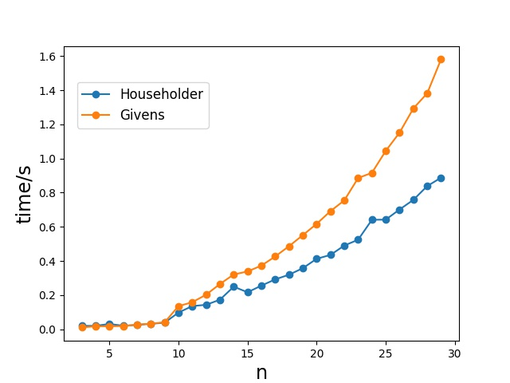

 
 计算物理第三次作业  
 刘茁   
 1500011438 

# 1. Householder 与Givens 在QR 分解中的比较
本题代码见question1文件夹
## (a)
### 使用Householder
- Householder矩阵为
$$
P _ { ( k ) } = \left[ \begin{array} { c c } { \mathbb { 1 } _ { k } } & { 0 } \\ { 0 } & { R _ { n - k } } \end{array} \right] , R _ { n - k } = 1 _ { n - k } - 2 \frac { w ^ { ( k ) } \left( w ^ { ( k ) } \right) ^ { T } } { \left\| w ^ { ( k ) } \right\| _ { 2 } ^ { 2 } }
$$
其中，$w ^ { ( k ) }$由下式决定
$$
w ^ { ( k ) } = x ^ { ( n - k ) } \pm \left\| x ^ { ( n - k ) } \right\| _ { 2 } e _ { 1 } ^ { ( n - k ) }
$$
- 计算向量$w^{(k)}$，要求$x^{(n-k)}$的欧式模，计算量为$(n-k)$次。
  
  计算$P_{(k)}$要进行一次矢量点乘运算和和一次除法，因此$P_{(k)}$变换的计算量为$2\times(n-k)+1$次

  每次迭代时，前$k-1$列无需计算，因此每次利用Householder变换进行迭代需要进行$(n-k+1)\times(2\times(n-k)+1)$次运算；保留到领头阶，总共的运算次数为
$$\sum_{k=0}^{n-2}(n-k+1)\times(2\times(n-k)+1)\approx \frac 2 3 n^3$$
- Q 的计算为
  $$Q^T=P_{(n-2)}P_{(n-1)}\cdots P_{(0)}$$
 构建P总共需要约$n^2$次计算， 之后每一次计算都要对全部n列进行，总的计算次数为
 $$
2 n ^ { 2 } + \sum _ { k = 1 } ^ { n - 2 } n \times ( 2 \times ( n - k ) + 1 ) \approx n ^ { 3 }
$$
- 因此总的计算次数为(保留到最高阶)
  $$\frac{5}{3}n^3$$

### 使用Givens
- 记转动矩阵 $G _ { 2,1 } = G ( 1,2 , \theta )$，givens变换得到上三角矩阵的过程应该可以记为
$$
\left( G _ { n , n - 1 } G _ { n , n - 2 } G _ { n - 1 , n - 2 } \cdots G _ { 2,1 } \right) A = Q ^ { T } A = R
$$
- 在对第j列的对角元以下的元素进行消元时，仅需计算从第j列到第n列的旋转,每次旋转的计算次数为$2+2\times2\times (n-j+1)$ (对靠右的两条元素进行运算）
  
  那么，对于矩阵R的计算，总共的运算次数为：
$$\sum_{j=1}^{n-1}(n-j)\times(2+2\times2\times (n-j+1))\approx \frac 4 3 n^3$$

- Q的计算为
$$
Q ^ { T } = G _ { n , n - 1 } G _ { n , n - 2 } G _ { n - 1 , n - 2 } \cdots G _ { 2,1 }
$$
其中$G_{i,j}$仅需对第j+1到第n列进行计算，每次计算次数也是$2+2\times2\times (n-j+1)$，因此总计算次数和矩阵R的计算次数相同，也是$\frac 4 3 n^3$次
- 因此总的计算次数为
  $$\frac{8}{3}n^3$$

## (d)
- 编写程序 run_time.py来比较运行时间。
- 这里我不仅仅比较了$n=6$的情况（n表示方阵维度），我取了n=3~50的情况，结果如下图所示。

- 可以看出，在维度较大时，Householder方法会显著地快于Givens变换，尽管运行的绝对时间没有意义，但是两种方法运行时间的比例与我们之前的讨论是一致的。在维度较小时，由于运行总时间很小，并不能很有效地比较我们之前讨论保留到n的最高阶的情况。

# 2. 幂次法求矩阵最大模的本征值和本征矢
## (a)
- 原子满足的经典运动方程为
  $$\ddot{x_i}-[x_{i-1}+x_{i+1}-2x_i]=0$$
- 假设解满足
  $$x_i(t)=x_ie^{-i\omega t}$$
  则有
  $$-\omega^2x_i-[x_{i-1}+x_{i+1}-2x_i]=0$$
  注意到
  $$(-A)_{ij} = \delta_{i-1,j}+\delta_{i+1,j} - 2\delta_{i,j}$$
  于是有
  $$Ax = \lambda x$$
  其中$\lambda = \omega^2$

## (b)
- A的本征值为 $\lambda_1 \gt \lambda_2 \geq \lambda_3 \geq... \geq \lambda_N$，对应的本征矢为 $\bm{v_1},\bm{v_2},\bm{v_3},...,\bm{v_N}$。
- 将$\bm{q^{(0)}}$用本征矢展开
  $$\bm{q^{(0)}} = \sum_{i=1}^{N} a_i \bm{v_i}$$
  第k阶的公式很容易总结得到
  $$\bm{q^{(k)}} = \frac{\bm{z^{(k)}}}{||z^{(k)}||} = \frac{A\cdot \bm{q^{(k)}}}{||z^{(k)}||} = C \sum_{i=1}^N a_i \lambda_i^k \bm{v_i}$$
  其中C是归一化常数。
- $k \rightarrow \infty$ 时，
  $$\lim_{k \rightarrow \infty} \bm{q^{(k)}} = C \lim _ { k \rightarrow \infty } \lambda _ { 1 } ^ { k } \sum _ { i = 1 } ^ { N } a _ { i } \bm{v_{i}} \left( \frac { \lambda _ { i } } { \lambda _ { 1 } } \right) ^ { k } = C \lim _ { k \rightarrow \infty } a _ { 1 } \lambda _ { 1 } ^ { k }\bm{v_{1}}$$
    这是由于
    $$ \left| \frac { \lambda _ { i } } { \lambda _ { 1 } } \right| < 1 , \forall i \neq 1$$
    最后只剩下$\bm{v_1}$这个方向，根据归一化的特性，于是有
    $$\lim_{k \rightarrow \infty} \bm{q^{(k)}} = \bm{v_1}$$
    $$\lim_{k \rightarrow \infty} \bm{\nu^{(k)}} = \lim_{k \rightarrow \infty} \left[ \bm{q^{(k)}} \right] ^ { \dagger } A \bm{q^{(k)}}  = \bm{v_1}^{\dagger} A \bm{v_1} = \lambda_1$$
 - 编写程序 power_method.py 求解结果
    -  最大本征值 $\lambda_1 = 4.0$

    - 对应本征矢
  $[-0.31622777,  0.31622777, -0.31622777,  0.31622777, -0.31622777,  0.31622777, -0.31622777,  0.31622777, -0.31622777,  0.31622777]$

# 3. 关联函数的拟合和数据分析
本题代码见question3文件夹
## (a)
- 我这里利用标准差来估计误差
$$
\Delta C ( t ) = \sqrt { \frac { 1 } { N ( N - 1 ) } \sum _ { i = 1 } ^ { N } \left( C ^ { ( i ) } ( t ) - \overline { C } ( t ) \right) ^ { 2 } }
$$
误差结果如下图所示，具体的数据见附件

## (b)(c)
- 利用JackKnife 方法来计算$m_{eff}$及其误差，将其用散点图画出，具体的数据见附件。需要注意的是，我在画图时舍弃了第一个点，这是因为：首先，第一，我们的关注点在中间的平台区和靠近$N_t/2$的区域，时间片靠近0的地方并不是我们所关注的;第二，第一个点的数据误差较大与其他的点不符合，非常影响画图的美观性。
- 接着我利用下式来寻找$\chi^2/d.o.f$最小的$t_{min},t_{max}$
$$
arg \min _ { t _ { m i n } , t _ { m a x } } \frac { 1 } { t _ { \max } - t _ { \min } } \sum _ { t = t _ { \min } } ^ { t _ { \max } } \left( \frac { m _ { e f f } ( t ) - m } { \Delta m _ { e f f } ( t ) } \right) ^ { 2 }
$$

$$\chi^2 = \sum_{t_{min}}^{t_{max}}\left( \frac { m _ { e f f } ( t ) - m } { \Delta m _ { e f f } ( t ) } \right) ^ { 2 }$$
令
$$\frac{\partial \chi^2}{\partial m} = - 2\sum_{t_{min}}^{t_{max}}\left( \frac { m _ { e f f } ( t ) - m } { \Delta m _ { e f f } ( t ) }\right) = 0$$
则有
$$m = \frac{\sum_{t_{min}}^{t_{max}} \frac{m_{eff}(t)}{\Delta m_{eff}(t)}}{\sum_{t_{min}}^{t_{max}}\frac{1}{\Delta m_{eff}(t)}}$$
拟合的结果为
$$t_{min} = 12,t_{max} = 15, dimension = 3$$
$$m_{eff} = 0.24332$$

将拟合出的$m_{eff}$值和对应的区间用黄色的线条与之前的图画在一起，最后的结果为，具体的数据见附件。

## (d)
重复前两问的做法，结果如下
$$t_{min} = 5,t_{max} = 9, dimension = 3$$
$$m_{eff} = 0.24429$$

用这种ratio计算的结果我们可以发现,对于$m_{eff}$
,这种方法所计算的值十分稳定，在靠近 $N_t/2$的区域$m_{eff}$的值仍然保持基本不变。对于误差，这种方法在计算中间平台区域时误差有所增大，但相对分布十分平均。

## (e)
程序运行结果如下
$$\rho_{3,4} = 0.9792$$
$$\Delta \rho_{3,4} = 0.0034$$
$$\rho_{3,5} = 0.9575$$
$$\Delta \rho_{3,5} = 0.0062$$

# 附件
## 3.(a)
|$t$|$C(t)$|$\Delta C(t)$|$\Delta C(t) / \overline C(t)$|
|:-:|:-:|:-:|:-:|
|1|5.164e+07|293220.28|0.57%| 
|2|5.416e+07|300383.56|0.55%| 
|3|3.253e+07|211750.26|0.65%| 
|4|2.448e+07|164866.08|0.67%| 
|5|1.883e+07|132834.82|0.71%| 
|6|1.465e+07|108226.51|0.74%| 
|7|1.148e+07|89982.56|0.78%| 
|8|8.989e+06|72558.68|0.81%| 
|9|7.048e+06|59215.24|0.84%| 
|10|5.532e+06|48866.58|0.88%| 
|11|4.343e+06|40608.67|0.93%| 
|12|3.403e+06|33751.12|0.99%| 
|13|2.673e+06|28341.57|1.06%| 
|14|2.096e+06|23843.09|1.14%| 
|15|1.644e+06|19639.89|1.19%| 
|16|1.288e+06|16471.12|1.28%| 
|17|1.010e+06|13842.15|1.37%| 
|18|7.921e+05|11651.16|1.47%| 
|19|6.220e+05|9777.13|1.57%| 
|20|4.883e+05|8199.42|1.68%| 
|21|3.826e+05|6728.90|1.76%| 
|22|2.999e+05|5568.07|1.86%| 
|23|2.363e+05|4616.11|1.95%| 
|24|1.862e+05|3872.31|2.08%| 
|25|1.470e+05|3234.64|2.20%| 
|26|1.165e+05|2729.74|2.34%| 
|27|9.307e+04|2308.67|2.48%| 
|28|7.547e+04|1992.72|2.64%| 
|29|6.207e+04|1724.63|2.78%| 
|30|5.248e+04|1523.80|2.90%| 
|31|4.609e+04|1391.94|3.02%| 
|32|4.252e+04|1317.28|3.10%| 

## 3.(b)
|$t$|$m_{eff}(t)$|$\Delta m_{eff}(t)$|
|:-:|:-:|:-:|
|1|0.50967|0.00462| 
|2|0.28438|0.00488| 
|3|0.26267|0.00545| 
|4|0.25094|0.00542| 
|5|0.24396|0.00577| 
|6|0.24430|0.00540| 
|7|0.24326|0.00540| 
|8|0.24224|0.00554| 
|9|0.24188|0.00580| 
|10|0.24386|0.00605| 
|11|0.24177|0.00640| 
|12|0.24319|0.00624| 
|13|0.24283|0.00570| 
|14|0.24355|0.00679| 
|15|0.24397|0.00700| 
|16|0.24259|0.00712| 
|17|0.24169|0.00707| 
|18|0.24202|0.00706| 
|19|0.24384|0.00641| 
|20|0.24365|0.00733| 
|21|0.23850|0.00739| 
|22|0.23818|0.00822| 
|23|0.23636|0.00794| 
|24|0.23289|0.00913| 
|25|0.22415|0.00904| 
|26|0.20963|0.01071| 
|27|0.19556|0.01028| 
|28|0.16779|0.01254| 
|29|0.12970|0.01420| 
|30|0.08077|0.02197| 

## 3.(d)
|$t$|$m_{eff}(t)$|$\Delta m_{eff}(t)$|
|:-:|:-:|:-:|
|1|0.63519|0.00473| 
|2|0.31168|0.01095| 
|3|0.27921|0.01246| 
|4|0.26145|0.01253| 
|5|0.24341|0.01605| 
|6|0.24596|0.01520| 
|7|0.24489|0.01413| 
|8|0.24281|0.01494| 
|9|0.23867|0.01705| 
|10|0.24718|0.01482| 
|11|0.23947|0.01504| 
|12|0.24377|0.01524| 
|13|0.24168|0.01388| 
|14|0.24287|0.01589| 
|15|0.24617|0.01647| 
|16|0.24402|0.01600| 
|17|0.24117|0.01496| 
|18|0.23908|0.01690| 
|19|0.24414|0.01492| 
|20|0.25173|0.01492| 
|21|0.23902|0.01788| 
|22|0.24114|0.01876| 
|23|0.24204|0.01488| 
|24|0.24724|0.01643| 
|25|0.24864|0.01478| 
|26|0.23525|0.01929| 
|27|0.24741|0.01557| 
|28|0.24646|0.01576| 
|29|0.24614|0.01568| 
