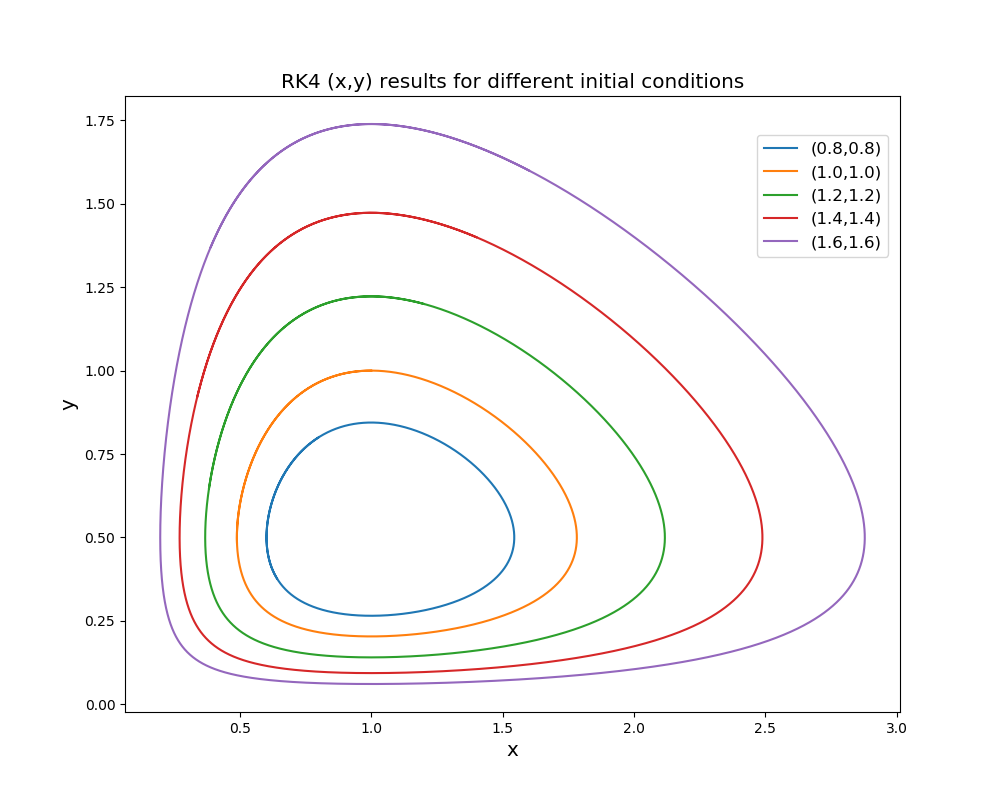

 
 计算物理第四次作业  
 刘茁   
 1500011438 

# 一、利用标准的4 阶Runge-Kutta来求解简单的常微分方程的初值问题
## (a) 
- 重新定义如下
  $$x' = \frac{\delta}{\gamma}x,y'=\frac{\beta}{\alpha}y,t'=\gamma t$$
- 我们有
  $$\dot x = \frac{\partial x}{\partial t} = \frac{\partial \gamma x'/\delta}{\partial t'/\gamma} = \frac{\gamma^2}{\delta} \dot x', \dot y = \frac{\alpha \gamma}{\beta} \dot y'$$
  $$\frac{\gamma^2}{\delta} \dot x'= \frac{\alpha \gamma}{\delta} x' - \frac{\alpha \gamma}{\delta}x'y' = \frac{\alpha \gamma}{\delta}x'(1-y') $$
  $$\frac{\alpha \gamma}{\beta} \dot y' =\frac{\alpha \gamma}{\beta}x'y' -\frac{\alpha \gamma}{\beta}y' =\frac{\alpha \gamma}{\beta}y'(x'-1) $$
- 最后有
  $$\dot x' = \frac{\alpha}{\gamma}x'(1-y')$$
  $$\dot y' = y'(x'-1)$$

## (b)
- $\dot x' = 0$ 时有
  $$x=0 或 y = \frac{\alpha}{\beta}$$
- $\dot y' = 0$ 时有
  $$y=0 或 x=\frac{\gamma}{\delta}$$
- 因此稳定解点有四个，分别是
  $$(0,0),(0,\frac{\gamma}{\delta}),(\frac{\alpha}{\beta},0),(\frac{\alpha}{\beta},\frac{\gamma}{\delta})$$
- 在稳定点附近进行小量展开
   - 对于$(0,0)$
  $$\dot x \approx \alpha \Delta x - \beta \Delta x \Delta y \approx \alpha \Delta x$$ 
  $$\dot y \approx \delta \Delta x \Delta y - \gamma \Delta y$$
    这显然是不稳定的。
  - 对于$(\frac{\alpha}{\beta}，\frac{\gamma}{\delta})$
   $$\dot { x } = \alpha \left( \frac { \gamma } { \delta } + \Delta x \right) - \beta \left( \frac { \gamma } { \delta } + \Delta x \right) \left( \frac { \alpha } { \beta } + \Delta y \right) \approx - \frac { \beta \gamma } { \delta } \Delta y$$
   $$\dot { y } = \delta \left( \frac { \gamma } { \delta } + \Delta x \right) \left( \frac { \alpha } { \beta } + \Delta y \right) - \gamma \left( \frac { \alpha } { \beta } + \Delta y \right) \approx \frac { \delta \alpha } { \beta } \Delta x$$
     于是有
    $$\ddot { x } + \alpha \gamma x = 0$$
    $$\ddot { y } + \alpha \gamma y = 0$$
    注意到$\alpha,\gamma$大于0，这说明x和y将会在稳定点附近震动，这一点时稳定的。

  - 对于$(\frac{\alpha}{\beta},0)$ 和   $(0,\frac{\gamma}{\delta})$ ，根据第一个点的分析，它们也是不稳定的。

## (c)
$$\frac{d x'}{d y'} = \frac{\alpha}{\gamma} \frac{x'(1-y')}{y'(x'-1)}$$
$$\frac{x'-1}{x'}dx' = \frac{\alpha}{\gamma} \frac{1-y'}{y'}dy'$$
积分后有
$$\frac{e^{x'+\frac{\alpha}{\gamma}y'}}{x'y'^{\frac{\alpha}{\gamma}}} = Const.$$
即
$$\frac { \exp ( \delta x + \beta y ) } { y ^ { \alpha } x ^ { \gamma } } = Const.$$

## (d)
- 编写程序  rungekutta.py 运行结果如下图所示。

- 需要说明的是，时间步长取为0.001。取为0.001的原因为：我在程序中比较了从$t_0$出发，用一次长度为$2h$的Runge-Kutta一次和用两次长度为$h$的Runge-Kutta的方法将微分方程推到$t_0+2h$的位置。在步长取为0.001时，这两种方法一次的相差不足机器精度，在计算资源绰绰有余的情况下，取0.001是精确的。